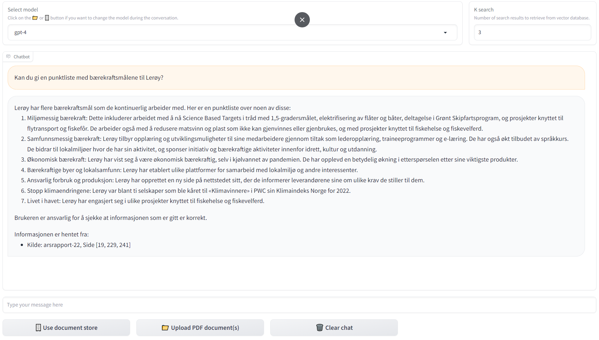

# QA bot for local PDF files 
## Overview
This repository contains a Proof of Concept (PoC) for a Q&A chatbot. The bot is designed to extract and answer questions from information found in local PDF files. It leverages the GPT API, Langchain, and a Gradio frontend.



For a deeper understanding of how Q&A bots function across various types of documents, we highly recommend reading [How do domain-specific chatbots work? An Overview of Retrieval Augmented Generation (RAG)](https://scriv.ai/guides/retrieval-augmented-generation-overview/)

## Structure overview
```
├── figs
│
├── dev_nbs
│   └── pdf.ipynb
│
├── src
│   ├── custom_chatbot.py
│   └── custom_files.py
│
├── app.py  # gradio app
│
└── README.md
```        

## Quick start
### Clone the repository:
```bash
git clone https://github.com/Leroy-Seafood-Group/fish-my-pdfs.git
cd fish-my-pdfs
```

### Install Required Packages
```bash
pip install -r requirements.txt
```

### Add OpenAI API Key
See best practices for API key safety: https://help.openai.com/en/articles/5112595-best-practices-for-api-key-safety

### Run the Gradio App
Launch the Gradio application
```bash
gradio app.py
```

### Optional: 
Run the application directly in the notebook
